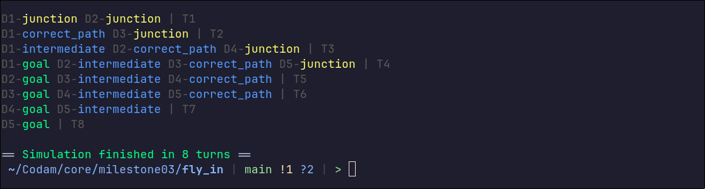

_This project has been created as part of the 42 curriculum by ivan-der_
# Fly-in
### Description
An efficient drone routing system that navigates a pack of drones
through a hub of connected zones while minimizing simulation turns and handling movement
constraints.

## Features
- Efficient multi-drone coordination
- Strict capacity and restriction management of both zones and connections:
    + Restricted zones take drones 2 turns to move to instead of 1
    + Blocked zones are completely inaccessible
    + Priority zones should always be preferred by drones if accessible
    + Configurable max capacity for zones and connections, defaults to 1
- Live visual feedback
- Both an interactive CLI and graphical interface


## Pathfinding
Dijkstra's algorithm was used for efficient drone routing with optimizations made
based on the projects restrictions.

**Optimizations include:**
- Strategic waiting in cases where it results in shorter travel distance
- Distances get calculated beforehand, from end to start avoiding dead ends
- Drone queues for waiting on a zone with full capacity, but faster travel time
- Deadlock and capacity overload prevention using live updating movement costs of zones


## User Experience
Both a colored terminal output and graphical user interface were implemented for an enhanced user experience.

Graphic rendering was made using pygame-ce and all assets were made by me using affinity.
For the pygame rendering, a speed-up option was added by pressing either up or down arrow keys, or J and K for the vim users.

The visualizer was inspired by one of my favorite games Mini Motorways :)


# Instructions
### Setup
> [!NOTE]
> Requires Python version 3.13+ with uv package manager, currently only supports MacOS and linux systems

First clone the repository, move into it and install dependencies
```shell
git clone https://github.com/Ilaivdv/codam-fly-in && cd codam-fly-in && make install
```
### Usage

To run normally, use
```shell
make
# or
make run
# for terminal only output
make terminal
# or to run directly
uv run -m src
```

To run the program with flags, see list of available flags
```shell
uv run -m src -h
```

# Resources
- [Dijkstra's algorithm](https://en.wikipedia.org/wiki/Dijkstra's_algorithm)
- [regex cheat sheet](https://www.geeksforgeeks.org/python/python-regex-cheat-sheet/)
- [Pygame Docs](https://www.pygame.org/docs/)

